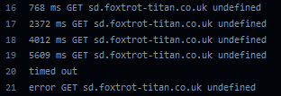

# Selenium

[Selenium](https://www.selenium.dev/) is a browser automation utility for creating browser-based regression tests. It is used to test the frontend and backend of the application.

## Issues

### Latency

[GitHub action runners](https://docs.github.com/en/actions/using-github-hosted-runners/about-github-hosted-runners). We're using GitHub actions runners to run these Selenium tests. The specs are decent (dual core x64, 7GB RAM, 14GB SSD). The latency is high and volatile. The runners are Microsoft Azure blades, so ICMP pings don't work. I don't know if it's a network or firewall limitation. To test latency I ended up using a [node script](https://github.com/bahmutov/test-server-ping) on the runner to check a TCP ping to the web server. The latency ended up around 800-3000ms. This is pretty extreme so explicit and implicit waits have been set to 30 seconds. A lower value may work too but I'm playing it safe.

The best solution is to setup Selenium runners on a Windows, Linux, and MacOS virtual machine, probably best hosted on a dedicated server. A less-than-ideal solution would be to run the selenium tests on the staging server. Latency wouldn't be an issue, but you'd only be able to test under a Linux distro.

### MacOS

Safari cannot run headless. This means that the Selenium tests cannot be run on MacOS/Safari on an actions runner. The only way to run the tests on MacOS would be to run them on a physical or virtual machine with a 'head' or GUI. As such, we cannot test MacOS on an actions runner. It could be worth investigating a virtual display driver, but I'm unsure.
